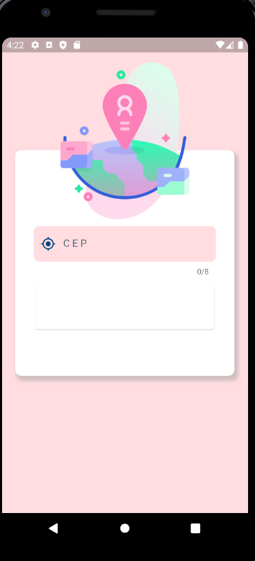
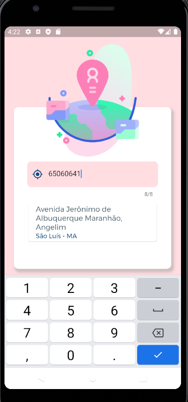

## ℹ️ Informações do projeto
- App criado para estudo de aplicações mobile e consumo de serviços. 
# Tecnologias utilizadas:

    - Dart
    - Flutter
    - Api 

# Objetivo do projeto
  - O App tem como objetivo consumir a API ViaCep dos Correios trazendo o endeço de acordo com o cep inserido.

